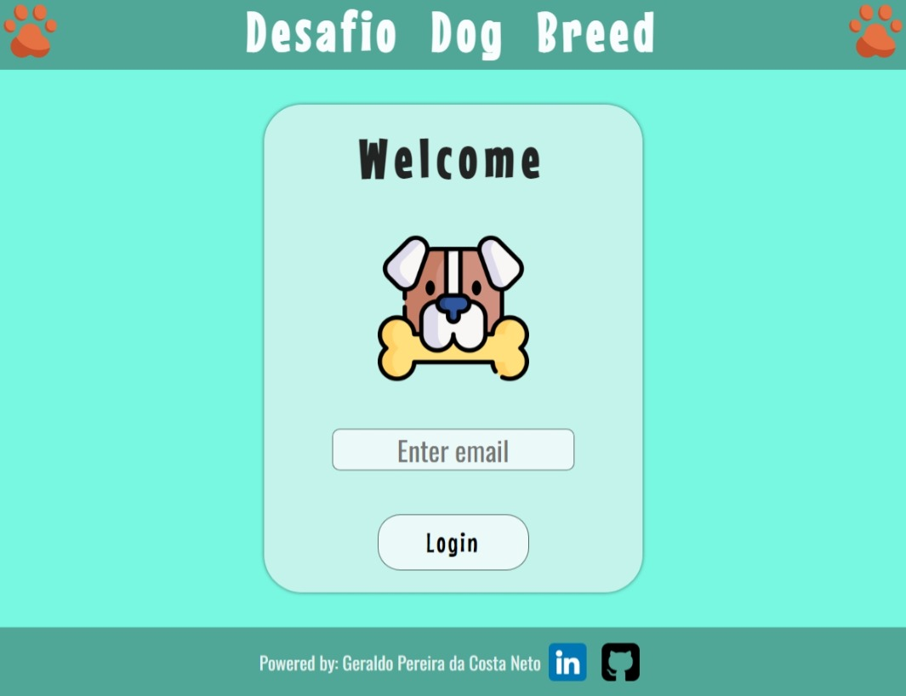
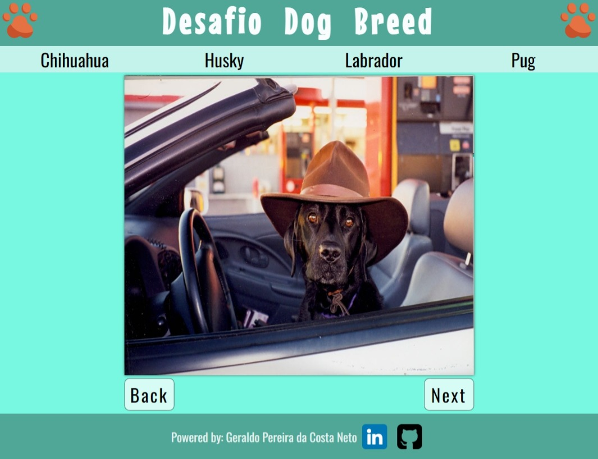

# Desafio Dog Breed
Repositório para colocar a resolução do <a href="https://gitlab.com/q9-tecnologia/desafios/mobile/desafio-dogbreed">desafio-dog-breed</a> da empresa Q9 Tecnologia

<hr>

## Gif do projeto


## Register Page


## List Page


# Install
Clone this repository and install it dependencies with this command: 
```sh
$ npm install
```

# Running
Run the application with `npm run dev` command, it will start the app:
```sh
$ npm run dev
